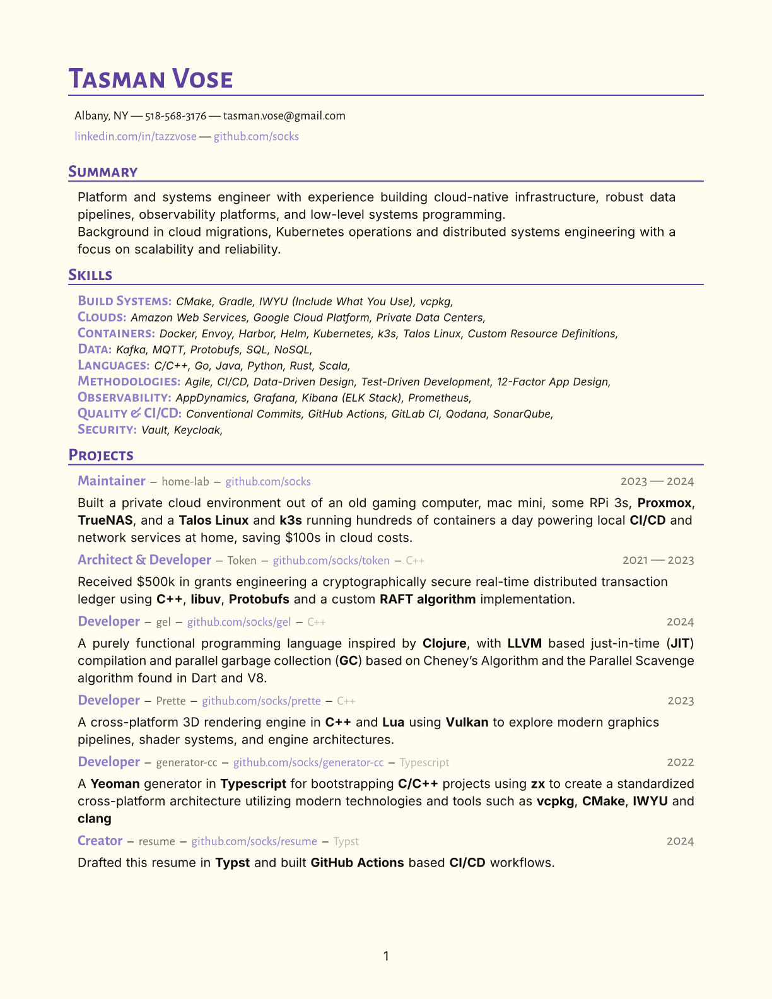
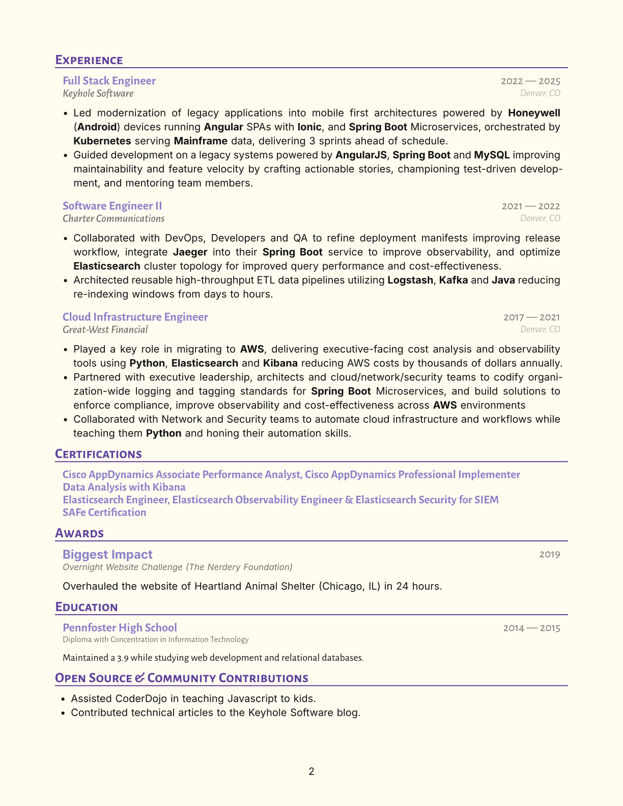

# Resume for @s0cks

This repository contains all the markup and resources required to build my (@s0cks) resume.

The generated documents are ATS friendly while maintaining a modern and visually appealing look using the
[Flexoki](https://stephango.com/flexoki) color palette from @kepano

## Examples




<p float="left" align="middle">
  
  
</p>

## Building

### Prerequisites

To build this resume, you will need the following things installed:

- [Typst](https://typst.app/) -- v0.14.x+
- The following fonts
  - [Inter](https://fonts.google.com/specimen/Inter)
  - [Alegreya Sans](https://fonts.google.com/specimen/Alegreya+Sans)
- [vale](https://vale.sh/) `Optional, useful for editing`

### Compiling

To compile to resume(s) using Typst you can do the following in the root of the project directory:

```zsh
typst compile TasmanVoseResume.typ # Produces TasmanVoseResume.pdf
```

## See Also

- [Awesome CV](https://github.com/posquit0/Awesome-CV) -- 📄 Awesome CV is LaTeX template for your outstanding job application
- [basic-resume](https://typst.app/universe/package/basic-resume) -- A Typst Universe package for a simple, standard resume, designed to work well with ATS
- [ats-friendly-resume](https://typst.app/universe/package/ats-friendly-resume) -- A Typst Universe package for a simple ats friendly resume built for developers
- [vantage-cv](https://typst.app/universe/package/vantage-cv) -- A Typst Universe package for an ATS friendly simple Typst CV template
- [Flexoki](https://stephango.com/flexoki) -- An inky color scheme for prose and code by @kepano
